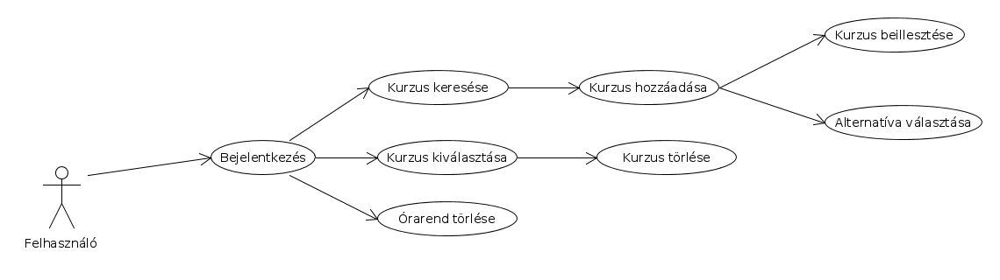

# Órarend Tervező

A projekt célja, egy olyan webes alkalmazás fejlesztése, amelyben a felhasználó képes naptári nézetben látni az általa felvett órákat. A program jelzi az ütközéseket, és alternatívákat kínál az ütköző kurzusok helyett ugyanabból a tárgyból. A heti naptári nézetben láthatóak a kiválasztott kurzusok nevei, helyszínei, időpontjai. Az alkalmazásba a felhasználói fiókkal lehet bejelentkezni, és a program minden felhasználójának órarendjét tárolja.

A program az orarend információt a http://to.ttk.elte.hu/uj-tanrend oldalról gyűjti össze.

## Application Routes

 - `GET / `
     - If the user has a timetable redirect to `/timetable` 
     - Else display landing page
 - `GET /search`
    - Params:
        - `filter`: Search term
        - `by`: Search by (Values: `any`, `name`, `code`)
 - `GET /timetable`:
    - Display saved timetable
    - If there is no timetable redirect to `/timetable/create`
 - `GET /timetable/create`:
    - Display the timetable creation page
 - `PUT /timetable`:
    - Save a new timetable
 - `GET /timetable/edit`:
    - Display the timetable edit page
 - Authentication Routes:
    - `GET /auth/login`: Show login page
    - `POST /auth/login`: Process login form
    - `POST /auth/logout`: Log the user out
    - `GET /auth/register`: Process registration form
    - `POST /auth/register`: Process registration form

# Use Case




# E-K Diagram


# A Csapat

- Gaál Péter

- Randjelovic Igor


# Table Structure

## Users
| id | username | password_hash |

## Timetables
| id | user_id | data |

### data: 
```json
{
    "courses": [
        { 
            "name": "AlkFejl",
            "schedule": "tuesday|10-12",
            "location": "2.9999"
        },
        {
            "name": "Fonya",
            "schedule": "friday|14-16",
            "location": "-1.75"
        }
    ]
}
```
